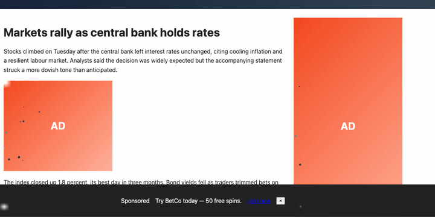
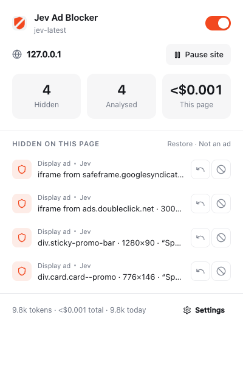
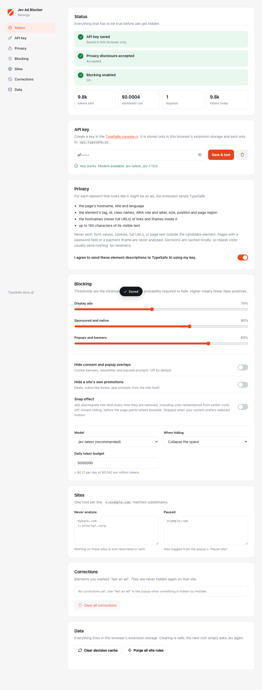

<p align="center">
  
</p>

<h1 align="center">Jev Ad Blocker</h1>

<p align="center">
  An ad blocker with <strong>no filter lists</strong>. A decision model looks at each suspicious element and decides.<br />
  Bring your own <a href="https://typesafe.ai">TypeSafe AI</a> key. Everything else runs in your browser.
</p>

<p align="center">
  
</p>

---

## Why

Traditional ad blockers ship megabytes of hand-maintained filter rules and lose the arms race one selector at a time. Jev Ad Blocker takes a different bet: describe each ad-looking element in a few structural fields and ask a model that is built for exactly this kind of narrow, fast judgement.

[Jev](https://docs.typesafe.ai) is TypeSafe's "System One" model. You send it *state* and typed *questions*; it returns calibrated probabilities, not generated text. It is fast (tens to hundreds of milliseconds), cheap ($0.042 per million input tokens, output free) and cannot hallucinate outside the answer space you give it. That makes it a good fit for "is this thing an ad?" at page scale.

## How it works

```
page ──► content script
          find candidates       third-party iframes, IAB ad sizes, ad-tech attributes, rel="sponsored",
                                "Sponsored" labels, id/class tokens, fixed overlays
          describe each one     tag, classes, size, position, page region, link/iframe hostnames,
                                up to 150 chars of visible text
          ──► service worker
                overrides  ►  keep
                cache hit  ►  reuse
                miss       ►  one Jev request per batch, one Choice question per candidate:
                              display_ad · sponsored_native · consent_or_popup ·
                              first_party_promo · site_content · site_ui
          hide when the aggregate ad probability clears a per-category threshold,
          beats the safe categories by a margin, and the answer is confident
```

Decisions are cached per host and structural fingerprint, so repeat visits usually send nothing. After a few consistent hits the extension materialises a CSS selector and hides the element before the page paints.

The exact request shape lives in [`src/shared/jev/questions.ts`](src/shared/jev/questions.ts). Code owns every threshold; the model only judges.

## Install

There is no store listing yet. Load it as an unpacked extension:

```bash
git clone https://github.com/fazlerocks/jev-adblock
cd jev-adblock
npm install
npm run build
```

1. Open `chrome://extensions`, turn on **Developer mode**, click **Load unpacked**, pick the `dist/` folder.
2. The settings page opens. Create a key at [console.typesafe.ai/keys](https://console.typesafe.ai/keys), paste it, click **Save & test**.
3. Read the privacy section and switch on the disclosure. The **Status** card turns green when everything is in place.

<p align="center">
  
</p>

## What leaves your browser

For each element that looks like it might be an ad, the extension sends TypeSafe:

- the page hostname, title and language
- the element's tag, id, class names, ARIA role and label, size, position and page region
- the hostnames of links and iframes inside it (never full URLs)
- up to 150 characters of its visible text

Never sent: form values, cookies, full URLs, or page text outside the candidate element. Pages containing a password field or a payment iframe are never analysed. Your API key is stored in the extension's local storage and sent only to `api.typesafe.ai`. There is no telemetry. See [PRIVACY.md](PRIVACY.md).

## Features

- **Bring your own key.** Nothing is analysed until a key is saved and the disclosure accepted.
- **Six categories, per-category thresholds.** Consent banners and a site's own promotions are recognised but never hidden unless you opt in.
- **Cache and site rules.** Decisions persist for seven days; repeated positives become pre-paint CSS rules that expire and self-correct.
- **Corrections.** "Not an ad" restores an element and pins it as never-hide for that site.
- **Budget and safety rails.** Daily token budget, circuit breaker on API failures, hard never-touch list for payment, auth, captcha and embed iframes.
- **Snap effect.** Optional: the ad turns to ash, crumbles from one corner and blows away as dust on a page-wide wind, then the space closes smoothly. Works on cross-site ad iframes too, and respects `prefers-reduced-motion`.
- **Per-page cost.** The popup shows tokens and dollars for the current page and lifetime.

<p align="center">
  
</p>

## Cost

A first visit to a heavy news page sends one request of roughly 10k input tokens, about $0.0004. Cached visits are free. At 250 new pages a day that is around 13 cents a month. The default daily budget is 5M tokens (about $0.21) and is enforced.

## Development

```bash
npm run dev         # rebuild on change; reload the extension from chrome://extensions
npm run typecheck   # tsc
npm test            # vitest unit tests
npm run e2e         # Playwright: loads dist/ into Chromium with api.typesafe.ai mocked
```

Useful scripts:

| Script | What it does |
|---|---|
| `node scripts/debug-fixture.mjs` | Prints the exact candidate descriptors sent to Jev for the fixture page |
| `node scripts/screenshot-ui.mjs <dir>` | Renders the popup and settings in a real extension context |
| `node scripts/snap-frames.mjs <dir>` | Records the snap effect and cuts a contact sheet |

### Layout

```
static/            manifest.json, popup and settings HTML/CSS, content.css, icons
src/shared/        types, constants, message contracts, sanitizer, fingerprint, Jev client, question builder, icons
src/content/       candidate discovery, descriptor, hider, snap effect, observer, site-rule injection
src/background/    router, classify pipeline, decisions, cache, site rules, usage, tab state, badge
src/popup/  src/options/
test/unit/  test/e2e/  test/fixtures/  test/mock/
```

No runtime dependencies. Icons are inlined [Lucide](https://lucide.dev) SVGs.

### Design notes

- **Jev cannot read HTML.** The descriptor in `src/content/describe.ts` is the accuracy lever. If you improve recall, improve it there.
- **Aggregate, don't argmax.** `decisions.ts` sums the ad categories before comparing to the threshold, so a 45/40 split between display and sponsored still hides.
- **Fail open.** Any error, timeout or budget stop results in nothing being hidden. The page always works.
- **The key never reaches content scripts.** A unit test fails if anything under `src/content/` references it.

## Known limitations

- The first visit to a page shows ads for the scan plus Jev latency before they are hidden. Cache hits hide on the first idle pass; site rules hide before paint (unless the snap effect is on, which deliberately lets the ad appear so it can be snapped).
- In-stream video ads inside a site's own player cannot be removed by hiding elements. That needs network-level blocking, which this project intentionally does not do.
- Cross-origin iframes are judged from the parent page; ads nested inside them are hidden as a whole or not at all.
- Native widgets that render inside an **open** shadow root (MGID, Taboola, Outbrain) are scanned and hidden at the host element. Closed shadow roots are not reachable by any extension.
- Requires the `<all_urls>` host permission to run on every site.

## Contributing

Issues and pull requests are welcome. See [CONTRIBUTING.md](CONTRIBUTING.md). The most valuable contributions right now are real-world false positives and false negatives with the descriptor that was sent, which `scripts/debug-fixture.mjs` and the service worker's Network tab both show.

## License

[MIT](LICENSE)
